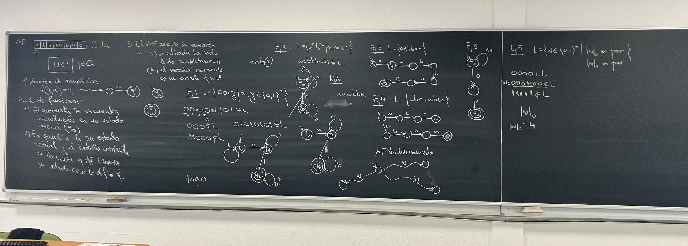
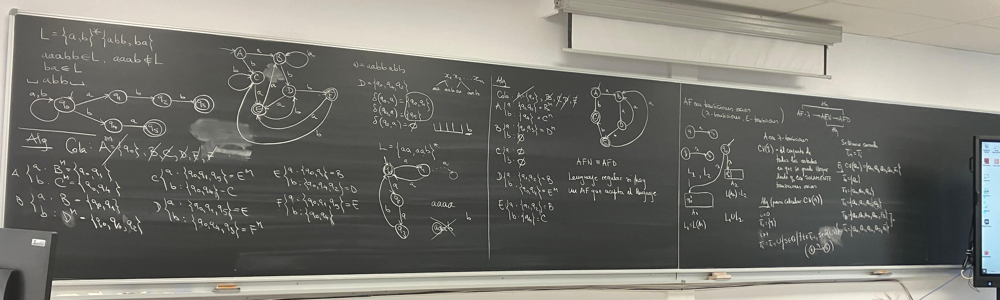
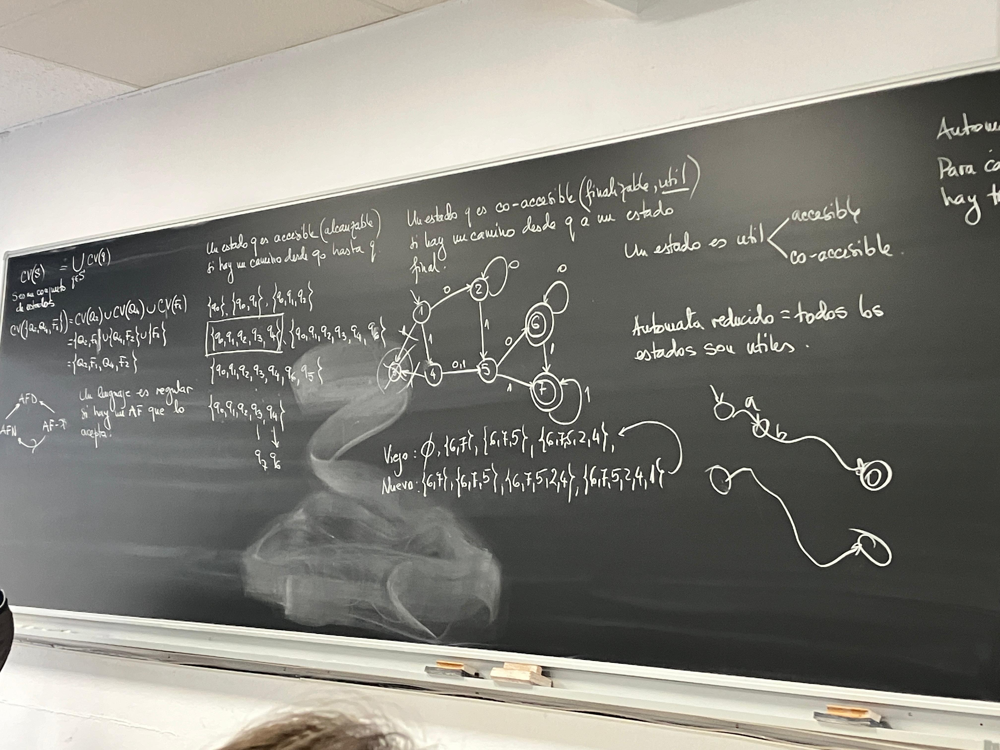
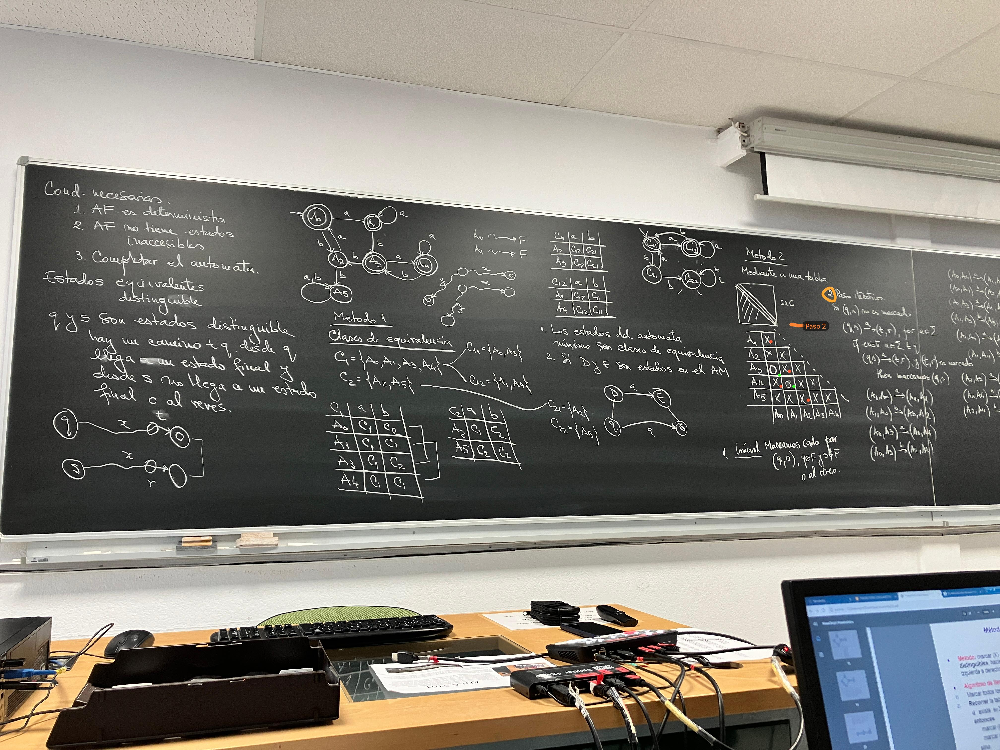
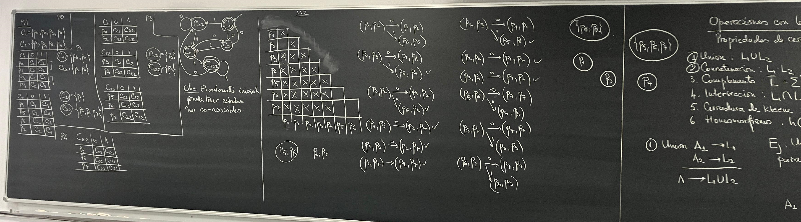
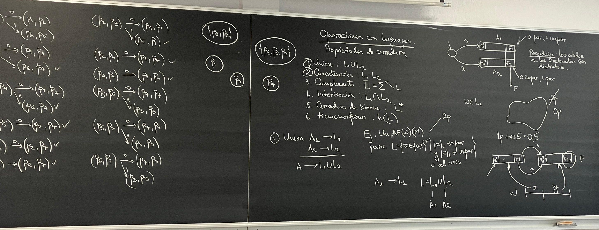

# Notes
## #1 Basic Concepts

## #2 NFA to DFA

## #3 Epsilon Closures, Accessibility and Co-Accessibility

## #4 Minimization


## #5 Operations With Languages



## #6 Pumping
Se da L. Es L regular?

Probar que L es regular
- Si : Escribir un automata finito que acepta L (No hay otra opción)
- No : ¿? (Lema de Bombeo)

Cumple Lema de Bombeo -> No regular

Regular <-> Automata finito acepta L

> No podemos escribir el automata porque seria muy grande.
> Con el Lema de Bombeo podemos probar si el automata no es regular.

```
Pasos:
1) Suponemos L regular.
2) Sea k constante del Lema de Bombeo.
3) [!!] Elegimos una palabra w, que cumple:
- Pertenece al Lenguaje
- Tiene un tamaño mayorigual a k
4) w tiene una decomposición: w = xyz
- |xy| <= k
- y != lambda
5) [!!] Averiguar donde se encuentra y en w
6) [!!] wi = xy^(i)z en L, para cada i >= 0
- Encontrar un valor para i (0,2) tal que la condicion NO se cumple.
7) Si no se cumple, resulta que L no es regular

El Lema de Bombeo dice que para cada legnguaje regular existe una constante k.
k es una constante que existe, pero no sabemos su valor (en paso 2)
```
---
Ejemplo: L ={a^n, b^n | n >= 1}

	1) Suponemos L regular.
	2) Sea k constante del Lema de Bombeo.
	3) [!!] Elegimos una palabra w, que cumple:
		- Pertenece al Lenguaje
		- Tiene un tamaño menos igual a k

		Elegimos un w tal que w = a^(k)b^(k)
			- w cumple que pertenece al lenguage 	
			|w| = 2k <= k

	4) w tiene una decomposición: w = xyz
		- |xy| <= k

		|---k---|---k---|
		|-x-|-y-|---z---|

	5) [!!] Averiguar donde se encuentra y en w

		x,y en p ya que |xy| <= k

	6) [!!] wi = xy^(i)z en L, para cada i >= 0
		- Encontrar un valor para i (0,2) tal que la condicion NO se cumple.

		w = a^(m) a^(n) a^(k-m-n) b^(k)
		   |-----|-----|---------------|
		     x     y          z
		w0 = a^(k-n) b^(k)
		w2 = a^(k+n) b^(k)

# Clas dia 23/4
Si queremos probar que w es capicua, con un algoritmo la idea es qquepuedo tener un variable i de izquierda y d de derecha y siempre recorremos simultaneamente con esas dos variables la entrada y comprobamos si las letras son iguales.
Que pasasi queremos implementar este automata con una AF, no podemos recorrer desde la derecha hacia la derecha solamente desde izq a derecha y despues de recorrer uuna parte no puedo recuperarla una vez consumida.
Resulta que lo mas probable es que este lenguaje no sea regular, y si el regular no es regular, la unica opcion es aplicar el lema de bombeo.
En nuestro caso que, Palabra podemos elegir? w = 1^p01^p

Una gramatica genera frases, en este caso podemos asimilar, la gramatica con nuestro modo de pensar cuandi construimos una frase.
Cuandi recibimos una frase, solo comprobamos si es correcta uy su semantaica pero cuando queremos transmitir una frase, necesitamos un generador (cadena, palabra) -> Gramatica

Se cetegorizan en 4 niveles
- Regulares : Producciones en la parte izq no terminal y derecha 3 posibilidades, lambda, terminal y nada mas, terminal seguido de no terminal
- Contexto Libre : Unica cond es el la parte izq tengo sol 1 terminal, no interesa derecha

G = (Sig, N, S, P)
- Sig : Alfabeto terminal o de constantes.
- N : Alfabeto de no terminales (variables)
Estos dos conjuntos son siempre disjuntos
- S : Simbolo inicial de start (axioma de la gramatica)
- P : Conjunto de producciones, tiene dos miembros (el izuiqerdo siempre contiene al menos un terminal)

Paso de derivación en una gramática:
Si tenemos una cadena y cada cadena que interviene en las derivaciones se llama forma sentencial y tengo una produccion a -> b
como se aplica este produccion a esta forma sentencial?
- Busco si la forma sentencial contiene la subcadena a
- No, no se puede aplciar
- Si lo contiene el resultado es : (z1) prefijo cte, alpha -> beta, sufijo cte (z2)
Que pasa si contiene más de una paracicion de alpha?
Cuando aplicamos la produccion podemos elegir de manera no determinista una aparicion.

	terminales -> minusculas
	no terminales -> mayusculas

	Ejemplo:

Que significa una derivacion de mas pasos?
Ej: aYYbYXa
En el primer paso aplicao regla 5 y obtengo
aYaSvYXa
Continuo la derivacion con aplicar la regla 2
aYabXavYXa
Puedo continuar con una regla 4 por ejemplo
aYababYXa
Si quiero mostrar que esta forma setencial se peude llegar a otra con derivaciones de mas pasos, se escribe directamente aYYbYXa ->* aYababYXa

El lenguaje generado de una gramatica es formado de todas palabras w pero solamente palabras de terminales tal que desde el simbolo inicia puedo con una derivacion arbitraria llegar a w.
Contienetodas pero solo terminales.
Cada palabra se puedoe obtener del simbolo inicial con una derivacion con cierto numero de pasos
L(G) = {w IN Z*|S->* w}

Gramatica -> Lenguage:
Ejemplo: A->aBa
Regular o Contexto libre?
NO REGULAR : tenemos un no terminal pero en derecha, noterminal seguido terminal seguido noterminal
A->aa
NO REGULAR
A-B
NO REGULAR
a->bB
NO REGULAR, NO ES NADA

Lenguage -> Gramatica:
L = {xbby|x,y IN {a,b}}
Todas las cadenas con contiene la subcadena ???
Intentamos asignar a cada no terminal un significado, una semantica.
Por ejemplo S va a generar la primera parte x, qe puede que sea cualquier palabra tal que si genero una a minuscula puedo continuar con la generacion
cuando he generado una b voy a cambiar el no terminal, por ejemplo A. Cuando tengo A, mi gramatica ha generado ya ultima vez una b.
El significado de A es: cuando he generado A significa que la ultima letra generado fue una B y que a partir de este A puedo generar otra b o a
Resulta que la B dice: has generado las dos b o puedo volver al inicio.
Con Bpuedo generar cualquier letra aB o bB o termino a o b
S -> aS|bA
S->aS -> aaS -> aabA
A -> bB|aS|b
B -> aB|bB|a|b

PASAR A AUTOMATA
Cuando haya una transicion A -> lambda, A es final

Tenemos dos algoritmos para pasar de una Gramatica a un Automata
Si volvemos a la pregunta, L es regular. En este momento, para la respuesta si, hasta ahora solo tendriamos una opcion: escribir un automata,
ahora podremos también escribir una gramatica.
para la respuesta no, seguimos solo teniendo Lema de Bombeo