# INDEX GITHUB
- **[1.-Basic-Concepts](#1-basic-concepts)**
- **[2. NFA to DFA](#2-nfa-to-dfa)**
- **[3. Epsilon Closures, Accessibility and Co-Accessibility](#3-epsilon-closures,-accessibility-and-co-accessibility)**
- **[4. Minimization](#4-minimization)**
- **[5. Properties and Operations](#5-properties-and-operations)**
- **[6. Pumping](#6-pumping)**
- **[7. Grammar](#7-grammar)**
- **[8. ER a Automata](#8-er-a-automata)**
- **[9. Automata a ER](#9-automata-a-er)**
- **[10. ER a Gramatica POR HACER](#10-er-a-gramatica-por-hacer)**
- **[11. Gramáticas de Contexto Libre - *GCL*](#11-gramáticas-de-contexto-libre---gcl)**
- **[12. Sintaxis](#12-sintaxis)**

> [!NOTE]
> Apuntes bien hechos a partir del temario del segundo examen **[11. Gramáticas de Contexto Libre - *GCL*](#11.-Gramáticas-de-Contexto-Libre-*GCL*)**.

> [!TIP]
> *Ciertas marcaciones se verán mal o distintas fuera de Obsidian.*
> 
> *Recomendable descargar **[Obsidian](https://obsidian.md/download)** y abrir este archivo haciendo un **clon** del repositorio.*

# INDEX OBSIDIAN
- **[[#1. Basic Concepts]]**
- **[[#2. NFA to DFA]]**
- **[[#3. Epsilon Closures, Accessibility and Co-Accessibility]]**
- **[[#4. Minimization]]**
- **[[#5. Properties and Operations]]**
- **[[#6. Pumping]]**
- **[[#7. Grammar]]**
- **[[#8. ER a Automata]]**
- **[[#9. Automata a ER]]**
- **[[#10. ER a Gramatica POR HACER]]**
- **[[#11. Gramáticas de Contexto Libre - *GCL*]]**
- **[[#12. Sintaxis]]**
---
# CLASS NOTES
## 1. Basic Concepts

## 2. NFA to DFA

## 3. Epsilon Closures, Accessibility and Co-Accessibility

## 4. Minimization


<details>
<summary><b>Notes</b></summary>

### 4.1. Equivalency Method
First the Automaton must be:
- **Complete**.
- **Deterministic**.
- **Without Unreachable States**.

Then, the algorithm is as follows:
1. **Create two Partitions**:
    - **C1** : Final States.
    - **C2** : Non-Final States.
2. **For each Partition**:
    - **For each State**: 
      1. Calculate the **Transition** with each **Symbol**.
      2. Its **Destination Partition** will be the **Partition** that contains the **Destination State** of the 
      **Transition**.
    - **Create a new Partition** grouping the **States** by its **Set of Destination Partitions**.
3. **Go to 2** if there are new **Partitions**.
4. The **States** of the minimized automaton are the **Partitions**.

> [!NOTE]
> A state is **final if X and Y are final** states. We made the task easier as we already separate the final states from 
> non-final states.

> [!NOTE]
> **Non-Co-Accessible** states and **Error** states are **automatically grouped** together by the algorithm.

### 4.2. Table Method
> _Also called **Myhill-Nerode Theorem**_

The algorithm is as follows:
1. **Create a Table** with the **States** as **Rows** and **Columns**.
   - If the automaton has **n** states, the table will be **n-1 x n-1**. So that no reflexive transitions are present.
2. **Mark** the pairs of states `<p,q>` that satisfies:
   - One is **final** and the other is **non-final**.

   > [!NOTE] **_Pseudocode_**: `q IS FINAL XOR p IS FINAL`

3. **Mark** the pairs of states `<p,q>` not marked that satisfies:
   - The pair `<δ(p,a), δ(q,a)>` is marked. Where `a` is a **symbol** from the **Alphabet**.

   > [!TIP] _If the pair of states cannot be marked, draw an arrow from the pair to the pair that should be marked. Then,_
   > _if target pair is eventually marked, also mark the origin pair. This way we have to make only one iteration._

4. **Repeat 3** if a pair was marked.

> [!WARNING] _Always mark every column then go down one row. Start from the top and go down._

</details>

## 5. Properties and Operations


## 6. Pumping


<details>
<summary><b>Apuntes</b></summary>

Se da L. Es L regular?

Probar que L es regular
- Si : Escribir un automaton finito que acepta L (No hay otra opción)
- No : ¿? (Lema de Bombeo)

Cumple Lema de Bombeo -> No regular

Regular <-> Automata finito acepta L

> No podemos escribir el automaton porque seria muy grande.
> Con el Lema de Bombeo podemos probar si el automaton no es regular.

```
Pasos:
1) Suponemos L regular.
2) Sea k constante del Lema de Bombeo.
3) [!!] Elegimos una palabra w, que cumple:
- Pertenece al Lenguaje
- Tiene un tamaño mayorigual a k
4) w tiene una decomposición: w = xyz
- |xy| <= k
- y != lambda
5) [!!] Averiguar donde se encuentra y en w
6) [!!] wi = xy^(i)z en L, para cada i >= 0
- Encontrar un valor para i (0,2) tal que la condicion NO se cumple.
7) Si no se cumple, resulta que L no es regular

El Lema de Bombeo dice que para cada legnguaje regular existe una constante k.
k es una constante que existe, pero no sabemos su valor (en paso 2)
```
---
Ejemplo: L ={a^n, b^n | n >= 1}

	1) Suponemos L regular.
	2) Sea k constante del Lema de Bombeo.
	3) [!!] Elegimos una palabra w, que cumple:
		- Pertenece al Lenguaje
		- Tiene un tamaño menos igual a k

		Elegimos un w tal que w = a^(k)b^(k)
			- w cumple que pertenece al lenguage 	
			|w| = 2k <= k

	4) w tiene una decomposición: w = xyz
		- |xy| <= k

		|---k---|---k---|
		|-x-|-y-|---z---|

	5) [!!] Averiguar donde se encuentra y en w

		x,y en p ya que |xy| <= k

	6) [!!] wi = xy^(i)z en L, para cada i >= 0
		- Encontrar un valor para i (0,2) tal que la condicion NO se cumple.

		w = a^(m) a^(n) a^(k-m-n) b^(k)
		   |-----|-----|---------------|
		     x     y          z
		w0 = a^(k-n) b^(k)
		w2 = a^(k+n) b^(k)

> [!NOTE]
> Si queremos probar que w es capicua, con un algoritmo la idea es que puedo tener una variable i de izquierda y d de derecha y siempre recorremos simultaneamente con esas dos variables la entrada y comprobamos si las letras son iguales.
> Que pasa si queremos implementar este automata con una AF, no podemos recorrer desde la derecha hacia la izquierda solamente desde izquierda a derecha y despues de recorrer una parte no puedo recuperarla una vez consumida.
> Resulta que lo mas probable es que este lenguaje no sea regular, y si el regular no es regular, la unica opcion es aplicar el lema de bombeo.
> En nuestro caso que, Palabra podemos elegir? w = 1^p01^p

</details>

## 7. Grammar


<details>
<summary><b>Apuntes</b></summary>

Una gramatica genera frases, en este caso podemos asimilar, la gramatica con nuestro modo de pensar cuando construimos una frase.
Cuando recibimos una frase, solo comprobamos si es correcta su semantaica pero cuando queremos transmitir una frase, necesitamos un generador (cadena, palabra) -> Gramatica

Se categorizan en 4 niveles:
- **Regulares** : Producciones en la parte izq no terminal y derecha 3 posibilidades: lambda o terminal y nada mas o terminal seguido de no terminal
  - **_Formato_**: `A -> lambda | a | aB`
- **Contexto Libre** : Unica cond es el la parte izquierda tenga solo 1 terminal, no interesa derecha.+
  - **_Formato_**: `A -> *`


### 7.1. Definicion Formal de Gramatica
**_G = (Sig, N, S, P)_**
- **Sig** : Alfabeto terminal o de constantes.
- **N** : Alfabeto de no terminales (variables)
- **S** : Simbolo inicial de start (axioma de la gramatica)
- **P** : Conjunto de producciones, tiene dos miembros (el izquierdo siempre contiene al menos un terminal)

> [!NOTE]
>  Sig y N son siempre disjuntos.

### 7.2. Paso de Derivación
Si tenemos una **cadena** y cada cadena que **interviene en las derivaciones** se llama **forma sentencial** y tengo una produccion `a -> b`
como se aplica esta produccion a esta forma sentencial?
- Busco si la **forma sentencial** contiene la subcadena `a`.
  - **No**. Entonces no se puede aplciar
  - **Si**. Entonces el resultado es : (z1) prefijo cte, alpha -> beta, sufijo cte (z2)
    
	> [!NOTE]
  	> Que pasa si contiene más de una aparición de alpha?
	> Cuando aplicamos la produccion podemos elegir de manera no determinista una aparicion.

  	> [!NOTE]
   	>  Convenio: **Terminales** -> Minusculas, **No Terminales** -> Mayusculas
	

**Que significa una derivacion de mas pasos?**

Ej: aYYbYXa

- En el primer paso aplicao regla 5 y obtengo aYaSvYXa
- Continuo la derivacion con aplicar la regla 2 aYabXavYXa
- Puedo continuar con una regla 4 por ejemplo aYababYXa

Si quiero mostrar que esta forma setencial se peude llegar a otra con derivaciones de mas pasos, se escribe directamente `aYYbYXa ->* aYababYXa`.

> [!NOTE]
> El **lenguaje generado de una gramatica** es formado de **todas palabras w** pero solamente palabras de **terminales** tal
> que desde el simbolo inicial puedo con una derivacion arbitraria llegar a w.
> Es decir: **Contiene todas pero solo terminales**.
> 
> Cada palabra se puede obtener del simbolo inicial con una derivacion con cierto numero de pasos
> `L(G) = {w IN Z*|S->* w}`.

### 7.3. Ejemplos Gramatica `->` Lenguage

- `A->aBa`
  - **NO REGULAR**
- `A->aa`
  - **NO REGULAR**
- `A-B`
  - **NO REGULAR**
- `a->bB`
  - **NO REGULAR**, **NO ES NADA**

### 7.4. Ejemplos Lenguaje `->` Gramatica

- L = {xbby|x,y IN {a,b}}

~~Todas las cadenas con ¿? contiene la subcadena ???~~

> [!NOTE]
> Intentamos **asignar** a cada **no terminal** un **significado**, una semantica.

- Por ejemplo S va a generar la primera parte x, que puede que sea cualquier palabra tal que si genero una a minuscula puedo continuar con la generacion
cuando he generado una b voy a cambiar el no terminal, por ejemplo A. 
- Cuando tengo A, mi gramatica ha generado ya ultima vez una b.

El significado de A es: cuando he generado A significa que la ultima letra generado fue una B y que a partir de este A puedo generar otra b o a

Resulta que la B dice: has generado las dos b o puedo volver al inicio.

Con B puedo generar cualquier letra aB o bB o termino a o b

- S -> aS|bA
- A -> bB|aS|b
- B -> aB|bB|a|b

### 7.5. Gramatica a Automata
Cuando haya una transicion A -> lambda, A es final

Tenemos dos algoritmos para pasar de una Gramatica a un Automata.

### 7.6. Nueva forma de verificar si un lenguaje es regular
Si volvemos a la pregunta, **_¿L es regular?_**. 
1. Para la respuesta **Es Regular**, podremos además de escribir un **_Automata_**, también escribir una **_Gramatica_**.
2. Para la respuesta **No es Regular**, seguimos solo teniendo **_Lema de Bombeo_**.
</details>

## 8. ER a Automata
### 8.1. Thomson (NFA-ε)

### 8.2. M'Naghten Yamada (NFA)
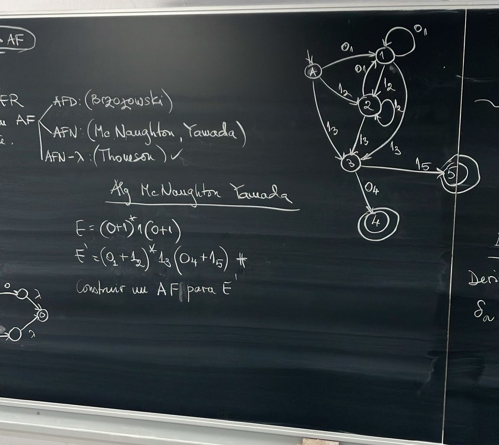
### 8.3 Brzozowski (DFA)


<details>
<summary><b>Apuntes</b></summary>

> [!NOTE]
> Otra forma de generar el automata es por intuición.


</details>

## 9. Automata a ER
### 9.1. Mediante Sistema de Ecuaciones


<details>
<summary><b>Apuntes</b></summary>

Ahora quiero sacar la expresion regular de un automata dado. 

Para **cualquier tipo de Automata** pero es aconsejable reducir el automata -> menos ecuaciones.

> [!NOTE]
> **La idea**:
> Tengo un automata y construyo un sistema de ecuaciones.


**Nos interesa la incognita asociada al estado inicial.**

La **solucion de cada una** de la incognitas va a ser una **expresion regular**. 

> ![NOTE]
> La expresion regular del estado inicial va a ser la expresion regular del automata.

#### 9.1.1. Propiedades
##### Solución para Recursiva
Formato de una recursiva: `X = rX + s`

**Ecuación general** `X = rX + s -> X = r*s`

##### Factor Común
> [!NOTE] Siempre a la derecha.
> 
Normalmente `ab+cb = b(a+c) = (a+c)b` por la propiedad **Conmutativa**.

Para estes calculos: `ab+cb = (a+c)b`, **No Conmutativa**.

##### Otras (Aunque no haga falta):
- `X + X = X`
- `X.X* = X*`
- `X*+lambda = X*`
- `X + lambda != X* + lambda`
- `X + lambda = X + lambda`
- `X* + lambda = X*`

> [!NOTE] Se pueden sacar intuitivamente.

Los ejercicios d este tipo piden exp reg, no se puede pedir un enunciado así. Se da un automata y se pida la exp reg minima, ya que no existe definicion que es una exp reg mas simple que otra.
-> Mas Corta -> Más Complicada -> Menos Letras? (No se puede).
No hay ninguna expresion para una exp reg mas simple.

</details>

### 9.2. Mediante Eliminación de Estados
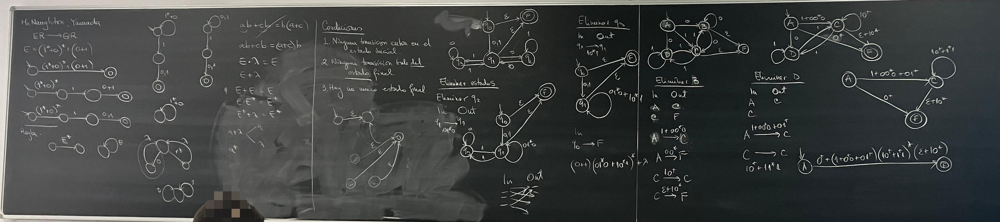

<details>
<summary><b>Apuntes</b></summary>

Ahora, empezamos con un automata y sacamos la exp reg con un metodo intuitivo parecido al primer.

> [!NOTE] 
> Eliminar estados tal que finalmente me quedo con un inicial, un final y una transicion entre ellos etiquetada con la transición puesta.

Antes, necesitamos cumplir con _ciertas condiciones_, si no cumple, veremos que no funciona:
1. **Ninguna transición entra en el estado inicial**.
2. **Ninguna transición sale del estado final**.
3. **Hay un unico estado final**.

**Si algun automata no cumple** con alguna de las condiciones:
1. Hacer un **nuevo estado inicial** con una **transicion vacia (e) hacia el original**.
2. Ir a **3**.
3. Con **transiciones vacias (e)**, unimos a un **nuevo estado final**, los **estados finales originales** ya no serán finales.

**_El Algoritmo_**:
1. **Eliminar un estado X** (Se aconseja para trabajar menos eliminar el estado con el numero minimo de transiciones).
2. Construir 2 conjuntos **In** y **Out**.
   - **In**: Estados que **llegan a X**.
   - **Out**: Estados que se **llegan desde X** (excepto si mismo).
3. **Eliminamos X**.
4. **Calculamos las expresiones para** `In --expresion--> Out` para cada estado afectado por la eliminacion de X.
5. **Creamos un nuevo automata**. el nuevo no es un atuomata normal , sino uno normalizado con expresiones regulares. Ir a **1** hasta que se eliminen todos.

</details>

## 10. ER a Gramatica POR HACER

## 11. Gramáticas de Contexto Libre - *GCL*


### 11.1. Árbol de Derivación
*Representación gráfica del proceso de derivación de una gramática.*

- **Raiz**: Nodo inicial
- **Nodos**: Símbolos No Terminales
- **Hojas**: Símbolos Terminales

### 11.2 Gramáticas Ambiguas
*Generan palabras por más de un árbol de derivación. No hay como detectar gramáticas ambiguas.*

> Es decir, se puede generar la misma palabra de distintas formas.

#### 11.2.1. Lenguajes inherentemente ambiguos
*Todas gramáticas que generan el lenguaje son ambiguas.*

#### 11.2.2. Grado de Ambigüedad
*Cantidad de árboles de derivación que generan una palabra.*

### 11.3 Limpiar Gramáticas

*Consiste en quitar los símbolos inútiles e innaccesibles.*

> [!NOTE]
> El profe y las diapositivas ponen nombres distintos a términos de este apartado.

|   Diapositivas  |   Clase  |
| --- | --- |
|   Símbolos Inútiles |  Símbolos No Generadores   |
| Símbolos Inaccesibles | Símbolos No Alcanzables |
| Útil y Accesible | Útil |

#### 11.3.1. Símbolos Inútiles
*Símbolos no terminales a través de los cuales no se puede llegar a una palabra.*

#### 11.3.2. Símbolos Inaccesibles
*Símbolos que no se pueden alcanzar desde el símbolo inicial.*

#### 11.3.3. Eliminación de Símbolos Inútiles - *No Generadores*
El símbolo de la parte izquierda de una derivación directa $A \to w : w \in \sigma^*$ es útil si:

- Al menos un símbolo de la parte derecha de la derivación es útiles.

> [!NOTE]
> El profe se complica demasiado la vida calculando $C$, solo hay q ir probando para cada $A$ si se puede llegar a un terminal de alguna forma.

*Repetir este proceso recursivamente.*

#### 11.3.4 Eliminación de Símbolos Inaccesibles - *No Alcanzables*
El símbolo de la parte derecha de una derivación directa $A \to w : w \in \sigma^*$ es accesible si:

- El símbolo de la parte izquierda de la derivación es accesible.

*Repetir este proceso recursivamente.*

#### 11.3.5 GCL Reducida
*Todos sus símbolos son:*
- **Alcanzables**
- **Generadores**

> Es decir, son *Útiles*.

### 11.4 Transformar Gramáticas de Tipo 2

*Se basa en eliminar **Producciones Unitarias** y **Producciones Vacías**.*

#### 11.4.1 Eliminar Producciones Vacías - $\lambda$ -prod.
*Se basa en actualizar las derivaciones quitando de cada Símbolo, transiciones lambda.*

> [!NOTE]
> Una forma que me sirve es escribir en una tabla el símbolo y su transición lambda y en filas las transiciones que derivan en el símbolo. Luego teniendo en cuenta que el símbolo ya no puede ser lambda, sacamos todas combinaciones posibles de las transiciones.

|  Prod. $B \to \lambda$   |  Prod. $A \to \lambda$ | Prod. $S \to \lambda$ | Prod $S \to \lambda$ |
| --- | --- | --- | --- |
|  $B \to BB$  |  $B$   | ||
| $S\to AAB$ | $AA$ | $A \| \lambda$
| $A\to BB$ | $B \| \lambda$ |
| $C\to aSB$ | $aS$ | |$a$
|| $S \to aAb$ | $ab$ |
||$A \to Ab$ | $b$

> [!NOTE]
> Al acabar, juntamos todas descomposiciones.

#### 11.4.2 Eliminar Producciones Unitarias
*Se basa en actualizar las derivaciones, de forma que no existan transiciones unitarias - del tipo $A \to B$.*

- $A \to A$ : Borramos.
- $A \to B$ : Añadimos a $A$ las derivaciones de $B$.

> *Forma guay*: $\forall A \to B : B \to \alpha_n$, pasar a: $A \to \alpha_n$

### 11.5 Forma Normal de Chomsky - *FNC*
*Cuando el LCL (Lenguaje de Contexto Libre) se genera por una gramática donde las producciones son de la forma:*
- $A \to BC$ 
- $A \to a$

Para ello tenemos que:
1. **Limpiar la Gramática**
	- **Eliminar Prefijos Comunes (Eliminar Ambiguedad)**
	1. **Eliminar Producciones-$\lambda$**
	2. **Eliminar Producciones Unitarias**
	3. **Eliminar Símbolos Inútiles**
3. Producciones con **2 o más implicados** son siempre **no terminales**.
4. Producciones con **3 o más implicados** divididas en producciones de **dos variables**.

#### 11.5.1 Eliminar Ambiguedad de GCL
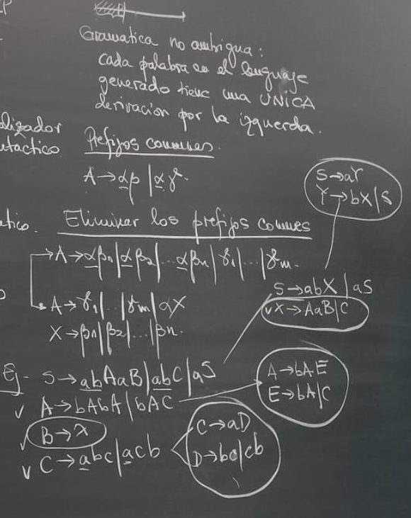
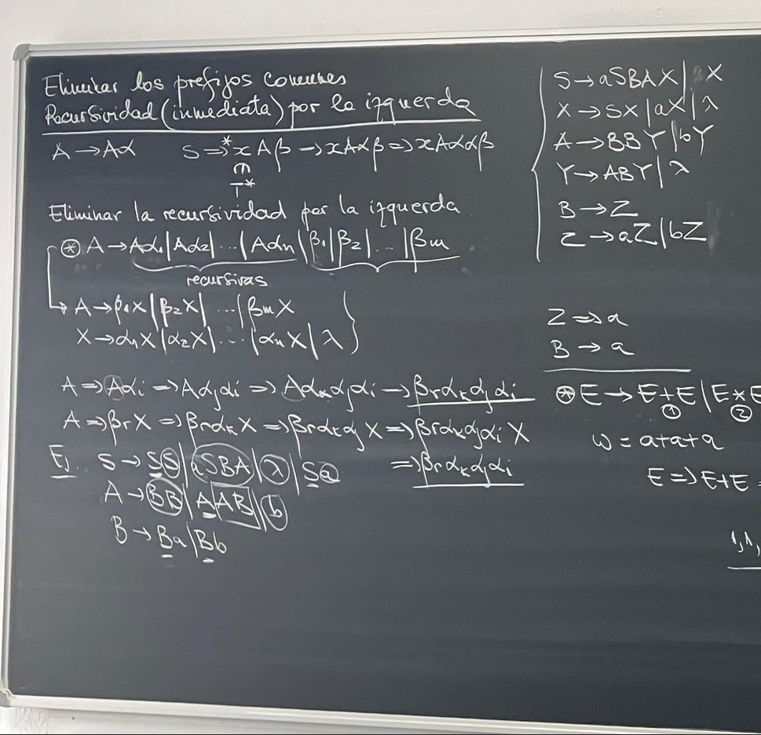

*Para pasar de una **[[#11.2 Gramáticas Ambiguas|Gramática Ambigua]]** a una no ambigua, buscamos eliminar los **[[#11.5.2 Prefijo Común|Prefijos Comunes]]**.*
 
*Para **Prefijos Comunes Normales**:*
1. Sacar "**Factor Común**" del **Símbolo**.
2. Crear nuevo **No Terminal** con los implicados del original.

> [!NOTE]
> *El paso 2 solo se realiza en producciones com más de un símbolo en cada implicado.*

*Para **Prefijos Comunes Recursivos Inmediatos por la Izquierda**:*

***Input***: 
- $A \to A \alpha_1 | ... | A \alpha_n | \beta_1 | ... | \beta_n$

***Output***: 
- $A \to \beta_1B | ... | \beta_nB$
- $B \to \alpha_1B | ... | \alpha_nB | \lambda$

*Donde*:
- $A$: Símbolo No terminal.
- $B$: Símbolo No terminal.
- $\alpha$: Subpalabra que procede $A$.
- $\beta$: Subpalabra que no procede $A$.

> [!NOTE]
> ***Mi razonamiento:***
> Sabemos que en una transición $A \to p A s | a | b$, $p$ actúa como prefijos, $s$ como sufijos y que el cuerpo de $A$ podría ser o $a$ o $b$. 
> 
> En el caso de **Recursividad Inmediata**, los prefijos no están presentes, quedando: $A \to As|a|b$. Es decir, el cuerpo de $A$ estará compuesto por o $a$ o $b$ y luego sufijos $s$, podemos traducir esto a: $A \to aB|bB$, siendo $B$ los sufijos $s$: $B \to sB|\lambda$.
> 
> Ahora podemos generalizar para cualquier producción y sacar la fórmula dada. $s$ será cualquier subpalabra que proceda $A$ ($\alpha$) y las subpalabras $a$ y $b$ serán cualquier subpalabra que no proceda $A$ ($\beta$).


#### 11.5.2 Prefijo Común
*Dada una producción $A \to X | Y$, esta producción es ambigua si los símbolos iniciales de $X$ e $Y$ son iguales.*

> [!NOTE]
> *Ejemplo:*
> $A \to ab | a$
> $A \to Ab|Aa|a$ - *Recursividad Inmediata por la Izquierda!*

#### 11.5.3 Paso 2
*Para realizar el paso 2: *
1. Creamos una nueva producción para cada producción existente donde haya dos o más implicados donde no son todos no terminales. 
2. Intercambiamos en producciones originales los símbolos terminales por los nuevos símbolos no terminales.
3. Las producciones nuevas producirán los símbolos terminales.

> [!NOTE]
> ***Ejemplo***: <br>
> - $A \to aAB | B$
> - $B \to b$
> 
> Como $A$ produce tanto no terminales como terminales, crearemos una nueva producción que produzca $a$, quedando:
> - $A \to CAB | B$
> - $B \to b$
> - $C \to a$

#### 11.5.4 Paso 3
*Para realizar el paso 3:*
1. Creamos una nueva producción para cada producción existente donde se produzca más de 2 terminales. 
2. Intercambiamos en las producciones originales dos implicados por la nueva producción.
3. La producción nueva tendrá 2 de los implicados de la producción original.

> [!NOTE]
> ***Ejemplo***: <br>
> - $A \to CAB | B$
> - $B \to b$
> - $C \to a$
> 
> Como $CAB$ tiene tres implicados, crearemos una nueva producción que produzca 2 de ellos - *elegimos CA* - , quedando:.
> - $A \to DB | B$
> - $B \to b$
> - $C \to a$
> - $D \to CA$ 

### 11.6 Algoritmo CYK
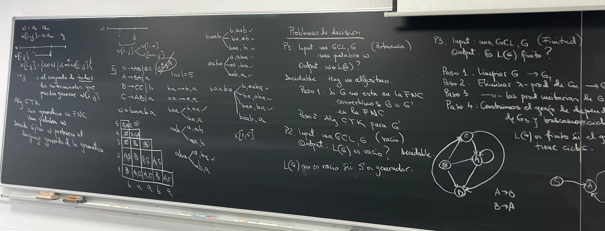

*Dado una gramática en FNC y una palabra $w$, nos dice si la palabra pertenece al lenguaje generado por la gramática.*

> [!WARNING]
> La gramática debe estar en FNC.

1. Construimos una matriz triangular inferior de $n\times x$.
2. En el eje X escribimos carácter por carácter, la palabra a probar ($w$).
3. Escribimos en la fila más baja el conjunto de símbolos que nos posibilita llegar directamente al carácter de abajo.
4. Escribimos en la fila arriba de la anterior, el conjunto de símbolos que nos posibilita llegar a la palabra actual - *teniendo en cuenta todas combinaciones posibles*. Para esto tenemos en cuenta los resultados que hemos sacado anteriormente de cada conjunto de caracteres.

> [!NOTE]
> Personalmente, prefiero hacer una pirámide que un triangulo. Es decir, poner el resultado de la fila superior entre las columnas de abajo.

***Ejemplo***: <br>
$G =$ $S \to AB |BC$, $A \to BA|a$, $B \to CC | b$, $C \to AB | a$ <br>
$w = baaba$


1. Escribimos los caracteres.
2. Para cada carácter, buscamos símbolos que les produzcan. *Ej. Para "a", los símbolos que le producen son: $A$ y $C$, por lo tanto lo apuntamos.*
3. Para cada palabra, para cada posible descomposición, buscamos símbolos que les produzcan. *Ej. Para la palabra "ba", su descomposición es: "b a", por lo tanto su conjunto de símbolos implicados será la combinatoria entre los símbolos que producen "b" y de los que producen "a", es decir: $\{B\} \times \{A,C\} = \{BA, BC\}$, ahora buscamos producciones que contienen estos implicados y apuntamos los implicantes.*
4. Repetimos el paso 3 hasta que toda file de $\emptyset$ o que lleguemos, a un valor.

> [!NOTE]
> Podemos comprobar que $w \in L$, ya que tenemos una serie de símbolos de la gramática que juntos generan esa palabra. En este caso: $S,C,A$.

### 11.7 Ejemplo: $w \in L(G)$
*Para probar que sí, tenemos que ser capaces de crear un árbol de derivación por la izquierda.*


### 11.8 Problemas de Decisión


#### 11.8.1 Problema - *Pertenencia de Palabra*
$w \in L(G)$ ?
*Para resolver este problema:*

1. Pasar $G$ a **FNC** $\to$ $G_1$.
2. Realizar **CYK** para $w$ en $G_1$.

#### 11.8.2 Problema - *Lenguaje Vacío*
$L(G)$ vacío?
*Para resolver este problema:*

- Probar si $S$ es **generador**.

#### 11.8.3 Problema - *Lenguaje Finito*
$L(G)$ finito?
*Para resolver este problema:*

1. Limpiar: $G \to G_1$.
2. Eliminar $\lambda$-prod: $G_1 \to G_2$.
3. Eliminar prod. unitarias: $G_2 \to G_3$.
4. Construir grafo de dependencia de $G_3$.

$L(G)$ será infinito cuando exista al menos un ciclo - *Ej. $A \to AB$*.

#### 11.8.4 Problemas no Decidibles
- GCL **ambigua**?
- LLC **inheremente amibiguo**?
- GLC $\cap$ GLC $= \emptyset$?
- GLC $=$ GLC?

### 11.9 Propiedades de Cerradura
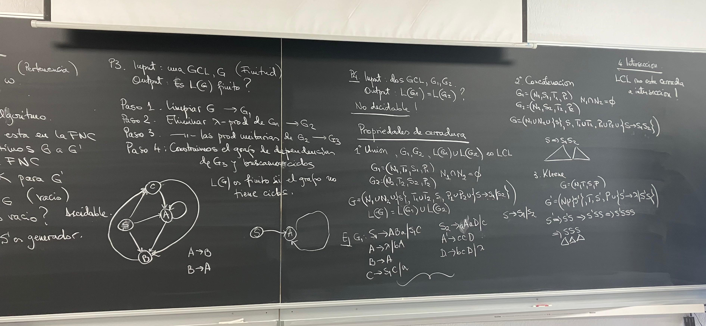

Sean $L_1, L_2$ **LLC**'s (*Lenguajes de Libre Contexto*) y $L_3$ **LR** (*Lenguaje Regular*) :

|  PROPIEDAD | OPERACIÓN|  RESULTADO  |
| --- | --- | --- |
|  Unión | $L = L_1 \cup L_2$ | **LLC** |
|  Intersección - **LLC** | $L = L_1 \cap L_2$ | **LLC** |
|  Intersección - **LR**| $L = L_1 \cap L_3$ | **¿?** |
|  Concatenación | $L = L_1L_2$ | **LLC** |
|  Kleene | $L = L_1^*$ | **LLC** |
|  Inversión | $L = L_1^R$ | **LLC** |
|  Complementario | $L = L_1^C$ | **¿?** |
|  Diferencia | $L = L_1-L_2$ | **¿?** |

### 11.10 Lema de Bombeo - *GCL* [POR HACER]
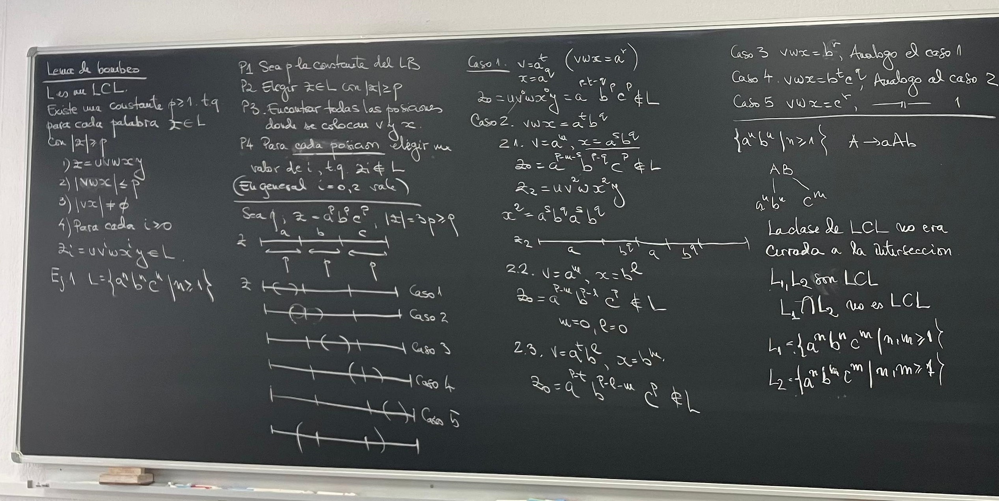
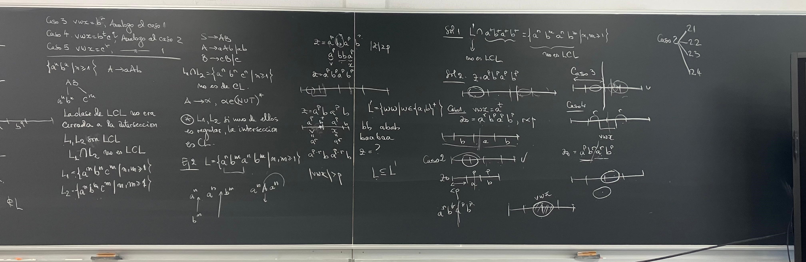

### 11.11 Autómata de Pila - *AP*
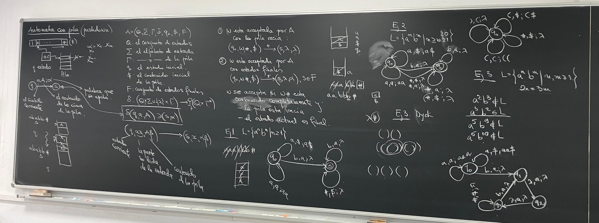

*Se define como:*
$AP = (\Sigma, Q, \Gamma, \delta, q_0, ], F)$
- $\Sigma$ : Alfabeto de las palabras.
- $Q$ : Conjunto de todos estados.
- $\Gamma$ : Alfabeto de la pila.
- $\delta$ : Función de transición - $(q_i, a, A) \to (q_j, BB)$.
	- $q_i$ : Estado actual.
	- $a$ : Símbolo de entrada.
	- $A$ : Elemento que se quita de la pila.
	- $q_j$ : Estado destino.
	- $BB$ : Elementos para poner en la pila.
- $q_0$ : Estado inicial del autómata.
- $]$ : Símbolo inicial de la pila.
- $F$ : Estados finales del autómata.

> [!NOTE]
> En mis apuntes los "Centinelas" - *caracteres que delimitan un valor* - son:
> - Centinela de **Entrada** : #$\to ]$
> - Centinela de **Pila** : $$\to \}$ 

#### 11.11.1 Representación Gráfica - *Grafos*
*Se hace igual a que en grafos de expresiones regulares, excepto:*
- Transiciones ($\delta$) : Flechas. Con etiquetas $a;A;BB$
	- $a$ : Símbolo de entrada.
	- $A$ : Elemento que se quita de la pila.
	- $BB$ : Elementos para poner en la pila.

> [!NOTE]
> Unas formas más intuitivas - *para mí* - de entender las transiciones en los grafos son:

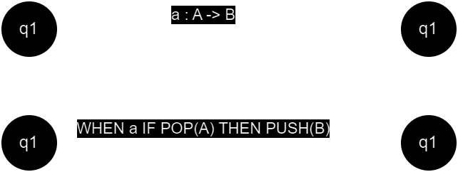

#### 11.11.2 Inicialización
*Antes de empezar a consumir entradas, el **AP** inicializa la:*
- **Entrada**, añadiendo al final de la palabra el **Centinela de Entrada**.
- **Pila**, añadiendo - *pusheando* - el **Centinela de Pila**.

#### 11.11.3 Consumición
*Un **AP** funciona de la siguiente forma:*
1. Recibe una palabra para que sea consumida y consume la primera entrada.
2. Busca transiciones en el estado actual que esperan esa entrada.
3. De las transiciones encontradas, prueba a consumir su símbolo definido. Si puede consumir:
	1. Se realiza la transición.
	2. Se elimina de la pila el símbolo definido.
	3. Se añade a la pila el símbolo definido.
	4. Si puede avanzar la entrada, pasa a 2.
	5. Pasa a **Aceptación**.
4. Pasa a **Aceptación**.

> [!NOTE]
> O en forma de código:

``` pascal
stack;
current_state;

FUNCTION consume (entry)                                    // entry es una letra
	transitions = current_state.transitions_with(entry)
	FOR transition IN transitions DO
		IF transition.stack_top_value == stack.peek() THEN  // peek devuelve top
			stack.pop()                                     // pop quita top
			stack.push(transition.stack_new_top_values)     // push añade a top
			current_state = transition.next_state
		END
	END
END
```

#### 11.11.4 Aceptación
*Un **Pushdown Automaton** acepta palabras - $w$ - cuando:*
- Al consumir totalmente $w$, tiene la **Pila Vacía**.
- Al consumir totalmente $w$, está en un **Estado Final**.

### 11.12 Ejemplos: AP

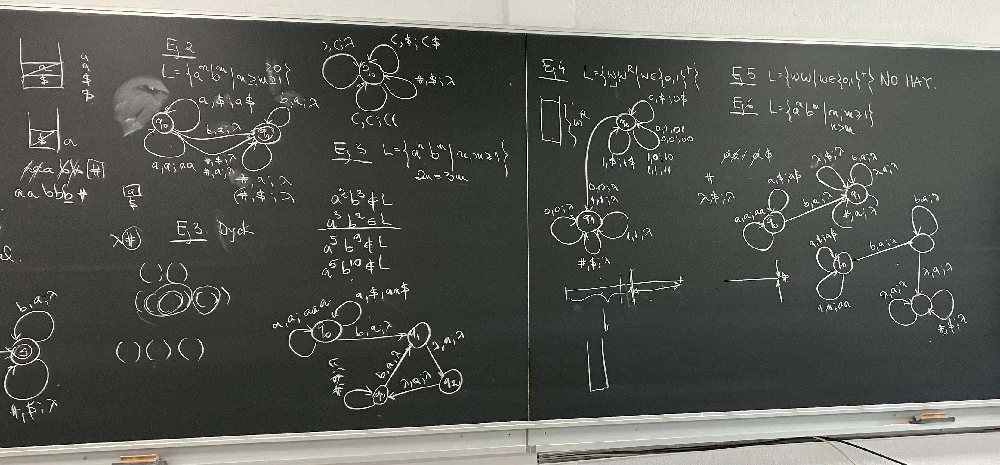

### 11.13 Transformación: GCL a AP
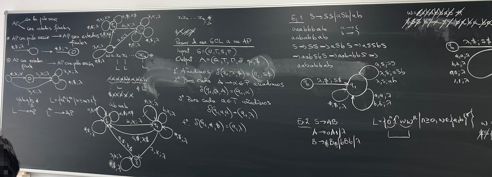
*Pasos:*
- **Añadir Estado Inicial** de inicialización.
- **Añadir Estado** para consumición.

1. **Pushear** el **Centinela de Pila** con transición ($\lambda$, }, $S$}).
2. $\forall A \to X : X$ es un implicado cualquiera, **creamos transición** $(\lambda, A, X)$.
3. $\forall a \in \Sigma$, **creamos transición** ($a$, $a$, $\lambda$).
4. **Creamos transición** para **Vaciado de Pila** ( ], }, $\lambda$).

> [!NOTE]
> Solo con dos estados ya nos sirve, ya que definiremos todas entradas como lambda y solo se aceptará la palabra si al consumirla la pila está vacía. De esta forma construimos un AP lo suficientemente general como para aceptar cualquier gramática. 
> 
> El inconveniente es tener varias transiciones lambda y generar un AP No Determinista.

### 11.14 Ejemplos: GLC a AP


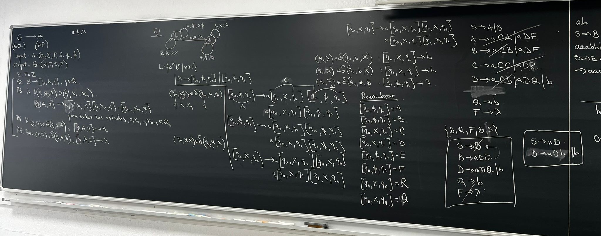

## 12. Sintaxis
*Las características sintácticas de un **LP** se pueden especificar mediante una **GCL**.*

*Esa especificación puede ser en formato **BNF** o **BNFA**.*

> [!NOTE]
> - **LP**: Lenguaje de Programación. 
> - **EBNF**: **BNFA**.
> - **AS**: Analizador Sintáctico.

### 12.1 Gramáticas en BNF y BNFA

#### 12.1.1 BNF
*Notación*:
- **Símbolos No Terminales ($A$)**: `<no_term>`
- **Símbolos Terminales ($a$)**: `term`
- **Producción ($\to$)**: `::=`

#### 12.1.1 BNFA
*Facilita el entendimiento de gramáticas BNF, sobre todo la opcionalidad y repetición de elementos.*

*Notación (BNF + Nuevas):*
- **Subpalabra Repetida**: `{subpalabra}` 
	> *Subpalabra aparece **0** **o más** veces.*
- **Subpalabra Opcional**: `[subpalabra]`
	> *Subpalabra aparece **0 o 1** vez.*
- **Subpalabra Variante**: `(subpalabra_1, subpalabra_2)`
	> *Aparece **subpalabra_1 o subpalabra_2**, etc.*
	
#### 12.1.2 Ejemplo: BNF
*Gramática en notación BNF que define la sintaxis de las declaraciones de variables en C.*

```
<declaraciones> ::= <una_declaracion> <declaraciones> | e 
<una_declaracion> ::= <tipo> <lista_id_var> ;
<lista_id_var> ::= id <mas_id>
<mas_id> ::= , id <mas_id> | e
<tipo> ::= int | float
```

#### 12.1.3 Ejemplo: BNFA
*Gramática en notación BNF que define la sintaxis de las declaraciones de variables en C.*

```
<declaraciones> ::= {<una_declaracion> ;}
<una_declaracion> ::= <tipo> id {, id}
<tipo> ::= int | float
```

### 12.2 Expresiones Aritméticas
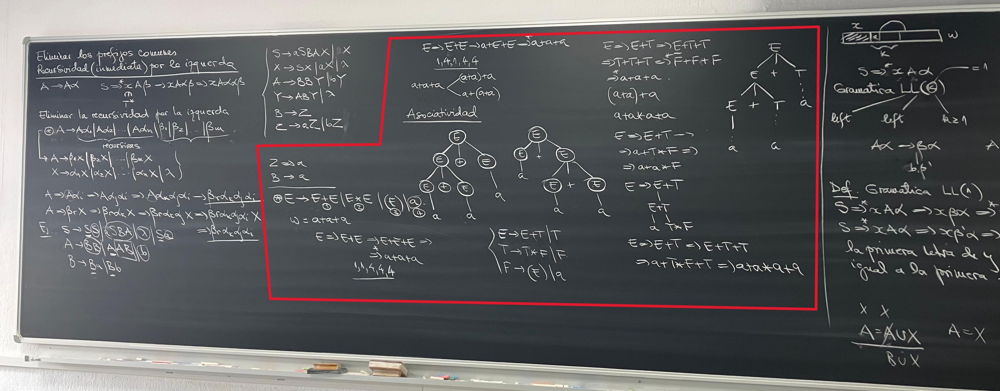

*Pg. 15 - 19 : Tema 6*

*Partimos de una gramática en BNF:*

```
<expr> ::= <expr> + <expr> | <expr> * <expr>| (<expr>) | a 
```

*Su equivalente:*

- $E \to E + E | E*E|(E)|a$

*Tenemos que resolver el problema de la **Precedencia entre Operadores**, para ello:*
- $\forall p, A_p \to O_p$
	> Es decir, para cada nivel de precedencia, creamos un **Símbolo No Terminal** para sus operadores.
	
> [!WARNING]
> **Menos Precedencia:** Más cerca al **Símbolo Inicial**.
> 
> **Más Precedencia**: Más cerca a los **Operandos**.

*Quedamos con la siguiente gramática en BNF:*
```
<expr> ::= <expr> + <expr> | <term>
<term> ::= <term> * <func> | <func>
<func> ::= (<expr>) | a
```

> [!NOTE]
> **Paréntesis**: Se trata como un Operando.
> 
> **Función** Se trata también como un Operando.
> 
> **Unarios (-)**: Tienen mayor precedencia. 

La gramática es ambigua por lo tanto tenemos que **[[#11.5.1 Eliminar Ambiguedad de GCL|quitarle la ambiguedad]]**, quedando:

```
<expr> ::= <expr> + <term> | <term>
<term> ::= <term> * <func> | <func>
<func> ::= (<expr>) | a
```

*La gramática en BNF es equivalente a:*

- $E \to E+T | T$
- $T \to T * F | F$
- $F \to (E) | a$

### 12.3 Analizadores Sintácticos
*Pag. 24 - : Tema 6*

*Tiene como fin **reconstruir** y **comprobar** si los **tokens** proporcionados por el analizados léxico **pueden ser generados por la gramática** sintáctica que define el lenguaje.*

#### 12.3.1 Símbolos por Adelantado
*Usados para **resolver** la **indeterminación** que se presente **en el proceso de reconstrucción** del árbol de derivación.*

> [!NOTE]
> Es el numero de símbolos de la entrada que leemos a la vez.

#### 12.3.2 Reconocimiento Descendente - *LL*

Forma de los **Analizadores Sintácticos** de reconstruir el árbol **desde la raíz a las hojas**.

> [!NOTE]
> **LL(K)** : **L**eft Reading, **L**eft Derivation, con **K** **Símbolos por Adelantado.**

*Ejemplo: Pag 26 : Tema 6*

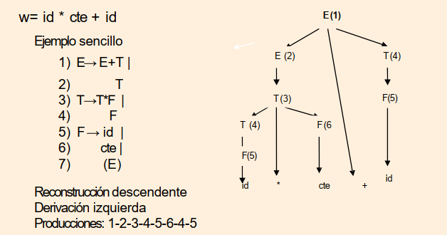

##### 12.3.2.1 Definición LL(1)
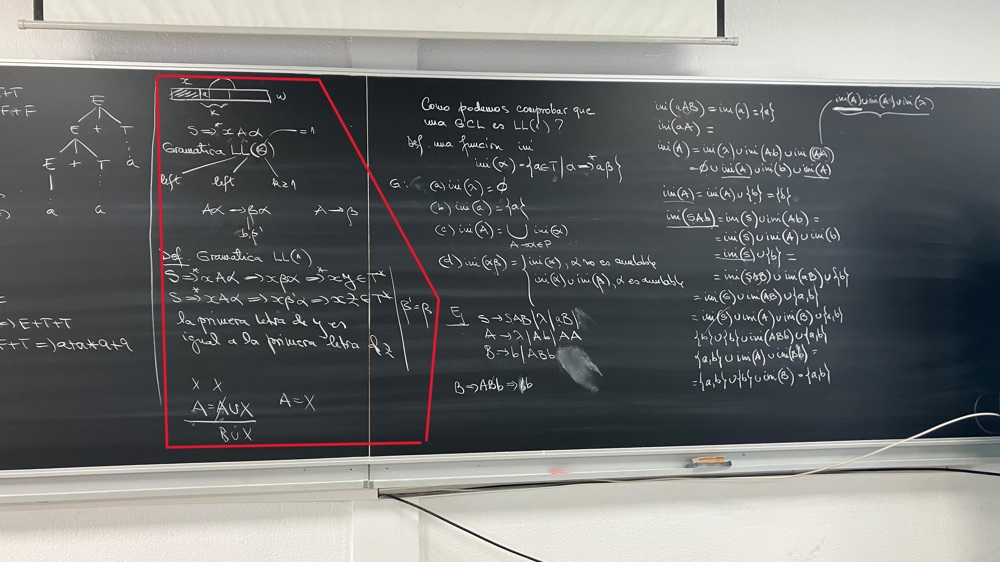

> [!NOTE]
> En mis palabras: "*Una **GCL** está en **LL(1)** si puedes elegir la siguiente producción con solo leer 1 entrada*". 
> 
> Sobre esta idea podemos asegurar que **si GCL es No Determinista,** **no es LL(1)**. Pero no podemos asegurar que un GCL Determinista sea siempre LL(1).

*Ejemplo LL(1): Pag 27 : Tema 6*

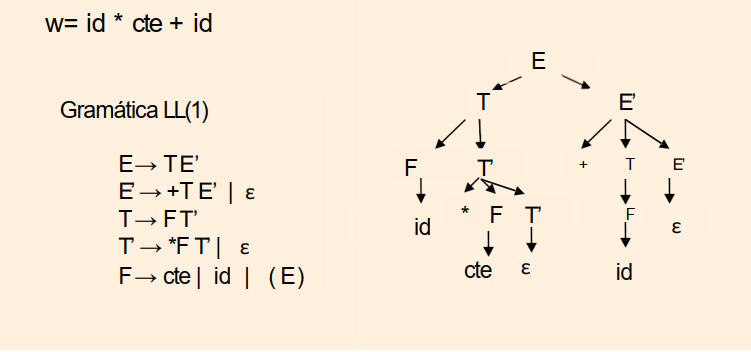

> [!NOTE]
> Los pasos para saber si una **Sintaxis** definida por una **GCL**  - *o por un **Lenguaje** definido por una **GCL** * - está en **LL(1)** se explican en el apartado **[[#12.5 Sintaxis en LL(1)?]]**

### 12.4 Calculo de Símbolos Directores 

#### 12.4.1 ¿Qué realmente Representan?

#### 12.4.2 Palabras Anulables
*Pueden o no tomar un valor en una producción.*

> [!NOTE]
> Será **Anulable** siempre y cuando no exista ninguna **Subpalabra** en $\alpha$ que lleve a un **Símbolo Terminal** $a$ .

*Ejemplo:*
- $A \to a|Bb$
- $B \to aC | \lambda$
- $C \to B | BA$

> [!NOTE]
> **Es la palabra $a$ de la producción $A \to a$ anulable?** <br> *Obviamente no, ya que $a$ ya es en sí **Símbolo Terminal**.*
>
> **Es la palabra $Bb$ de la producción $A \to Bb$ anulable?** <br> *No, ya que contiene un terminal - $b$.*
>
> **Es la palabra $aC$ de la producción $B \to aC$ anulable?** <br> *No, ya que contiene un terminal - $a$*.
>
> **Es la palabra $\lambda$ de la producción $B \to \lambda$ anulable?** <br> *Obviamente sí, ya que $\lambda$ es en sí la definición de nulo.*
>
> **Es la palabra $B$ de la producción $C \to B$ anulable?** <br> *Sí, ya que B podría ser nulo.*
>
> **Es la palabra $BA$ de la producción $C \to BA$ anulable?** <br> *No, ya que A no es anulable.*


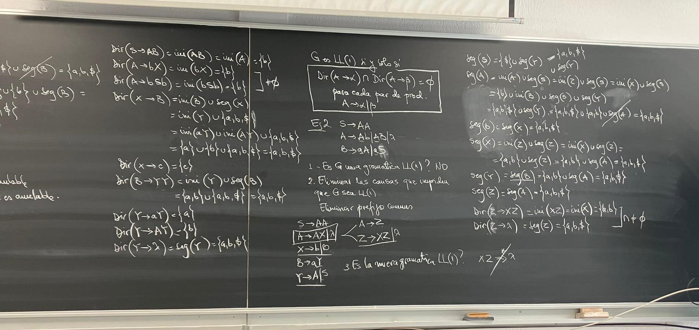
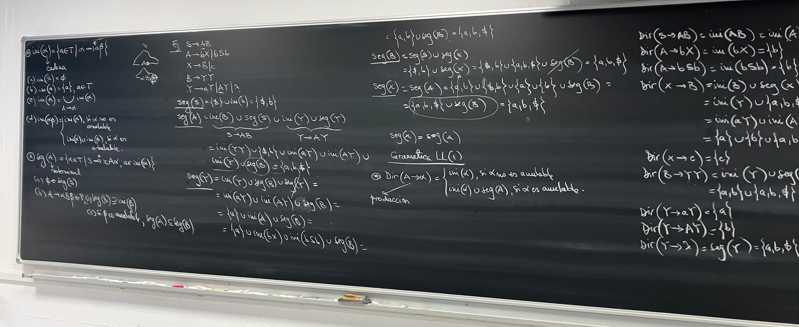

#### 12.4.2 Calcular: Iniciales  
*Representación*: **Inic($\alpha$)**

*En los apuntes*: **$I(\alpha)$**
> *$a$ : **Subpalabra**.*

$$
I(\alpha) = 
\begin{cases} 
a & \text{si el primer Símbolo de $\alpha$ es Terminal}\\ 
I(\beta) \cup I(\alpha - \beta) & \text{en el caso contrario}
\end{cases}
$$

> [!NOTE] 
> *En código:*
> ```pascal
> FUNCTION init(alpha) 
> 	x = first_symbol_of(alpha)
> 	IF x IS TERMINAL THEN
> 		x
> 	ELSE
> 		init(x) UNION init(alpha - x)
> 	END
> END
> ```


#### 12.4.3 Calcular: Seguidores  
*Representación*: **Seg($X$)**

*En los apuntes*: **$S(X)$**
> *$X$ :  **No Terminal**.*

$$
S(X) = \forall \beta \text{ que procede X }
\begin{cases} 
I(\beta) & \text{si $\beta$ es No Anulable}\\ 
I(\beta) \cup S(A) & \text{en el caso contrario}
\end{cases}
$$

> [!NOTE] 
> *En código:*
> ```pascal
> FUNCTION seg(X) 
> 	FOR beta EN LA DERECHA DE X DO
> 		IF beta IS NOT NULLABLE THEN
> 			inic(beta)
> 		ELSE
> 			inic(beta) UNION seg(A)
> 		END
> 	END
> END
> ```

#### 12.4.4 Calcular: Directores
*Representación*: **Dir($A \to \alpha$)**

*En los apuntes*: **$D(A \to \alpha)$**

> *$A$ : **No Terminal**.*
> *$\alpha$ : **Subpalabra**.*

$$
D(A \to \alpha) = 
\begin{cases} 
I(\alpha) & \text{si $\alpha$ es No Anulable}\\ 
I(\alpha) \cup S(A) & \text{en el caso contrario}
\end{cases}
$$

> [!NOTE] 
> *En código:*
> ```pascal
> FUNCTION dir(A, alpha)
> 	IF alpha IS NOT NULLABLE THEN
> 		inic(alpha)
> 	ELSE
> 		inic(alpha) UNION seg(A)
> 	END
> END
> ``` 


### 12.5 Comprobar si Sintaxis está en LL(1)

#### 12.5.1 ¿Qué realmente Significa estar en LL(1)?

#### 12.5.2 ¿Qué tiene que ver los Símbolos Directores con LL(1)?

#### 12.5.3 Pasos

### 12.6 Analizadores Descendentes Predictivos Recursivos

### 12.7 Actividad - Analizadores Léxico-Sintácticos Automáticos 

# [POR HACER]

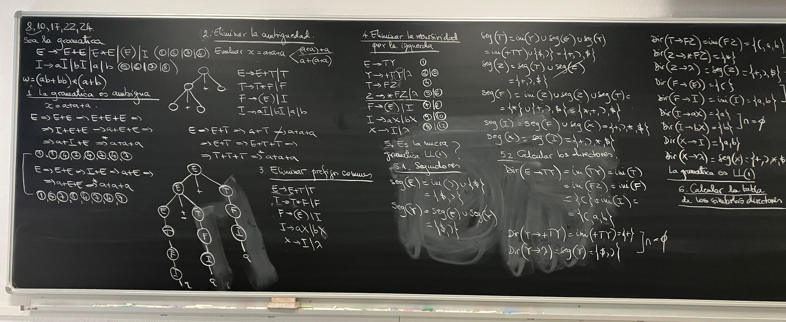


# [DUDAS]


Como S ya nos lleva a aS y de S podríamos seguir por X, por transitividad se podría eliminar la producción X -> aX ?